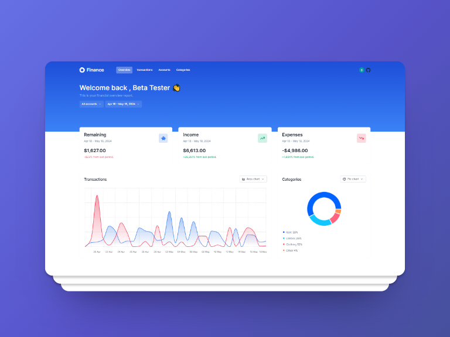

# Finanse

Track your income and expenses with Finanse.





## ‼️ Folder Structure

Here is the folder structure of this app.

```plaintext
finanse/
  |- app/
    |-- (auth)/
    |-- (dashboard)/
    |-- api/
    |-- apple-icon.png
    |-- favicon.ico
    |-- globals.css
    |-- icon1.png
    |-- icon2.png
    |-- layout.tsx
  |- components/
    |-- ui/
  |- config/
    |-- index.ts
  |- db/
    |-- drizzle.ts
    |-- schema.ts
  |- drizzle/
  |- features/
    |-- accounts/
    |-- categories/
    |-- summary/
    |-- transactions/
  |- hooks/
    |-- use-confirm.tsx
  |- lib/
    |-- hono.ts
    |-- utils.ts
  |- providers/
    |-- query-provider.tsx
    |-- sheet-provider.tsx
  |- public/
    |-- data.csv
    |-- github.svg
    |-- logo.svg
  |- scripts/
    |-- seed.ts
  |- .env.example
  |- .env.local
  |- .eslintrc.json
  |- .gitignore
  |- .prettierrc
  |- bun.lockb
  |- components.json
  |- drizzle.config.ts
  |- environment.d.ts
  |- middleware.ts
  |- next.config.mjs
  |- package-lock.json
  |- package.json
  |- postcss.config.js
  |- tailwind.config.ts
  |- tsconfig.json
</details>
```

# Getting Started

1. Make sure Git and NodeJS are installed.
2. Clone this repository to your local computer.
3. Create `.env.local` file in the root directory.
4. Contents of `.env.local`:

```plaintext
# .env.local

# disabled next.js telemetry
NEXT_TELEMETRY_DISABLED=1

# clerk auth keys
NEXT_PUBLIC_CLERK_PUBLISHABLE_KEY=pk_test_XXXXXXXXXXXXXXXXXXXXXXXXXXXXXXXXXXXXXXXXXX
CLERK_PUBLISHABLE_KEY=pk_test_XXXXXXXXXXXXXXXXXXXXXXXXXXXXXXXXXXXXXXXXXX
CLERK_SECRET_KEY=sk_test_XXXXXXXXXXXXXXXXXXXXXXXXXXXXXXXXXXXXXXXXXX

# clerk redirect url
NEXT_PUBLIC_CLERK_SIGN_IN_URL=/sign-in
NEXT_PUBLIC_CLERK_SIGN_UP_URL=/sign-up

# neon db url
DATABASE_URL=postgresql://<username>:<password>@<hostname>/<database>?sslmode=require

# app base url
NEXT_PUBLIC_APP_URL=http://localhost:3000
```

5. Obtain Clerk Authentication Keys
    - **Source**: Clerk Dashboard or Settings Page
    - **Procedure**:
        - Log in to your Clerk account.
        - Navigate to the dashboard or settings page.
        - Look for the section related to authentication keys.
        - Copy the `NEXT_PUBLIC_CLERK_PUBLISHABLE_KEY` and `CLERK_SECRET_KEY` provided in that section.

6. Retrieve Neon Database URI
    - **Source**: Database Provider (e.g., Neon, PostgreSQL)
    - **Procedure**:
        - Access your database provider's platform or configuration.
        - Locate the database connection details.
        - Replace `<username>`, `<password>`, `<hostname>`, and `<database>` placeholders in the URI with your actual database credentials.
        - Ensure to include `?sslmode=require` at the end of the URI for SSL mode requirement.

7. Specify Public App URL
    - **Procedure**:
        - Replace `http://localhost:3000` with the URL of your deployed application.

8. Save and Secure:
    - Save the changes to the `.env.local` file.

9. Install Project Dependencies using `npm install --legacy-peer-deps` or `yarn install --legacy-peer-deps`.

10. Migrate database:
    - In terminal, run `npm run db:generate` to generate database client and `npm run db:migrate` to make sure that your database is up-to-date along with schema.

11. Run the Seed Script:
    - In the same terminal, run the following command to execute the seed script:

    ```plaintext
    npm run db:seed
    ```

    This command uses `npm` to execute the Typescript file (`scripts/seed.ts`) and writes transaction data in database.

12. Verify Data in Database:
    - Once the script completes, check your database to ensure that the transaction data has been successfully seeded.

13. Now the app is fully configured 👍 and you can start using this app using either one of `npm run dev` or `yarn dev`.

**NOTE**: Please make sure to keep your API keys and configuration values secure and do not expose them publicly.

## Screenshot


## 📚 Learn More

To learn more about Next.js, take a look at the following resources:

- [Next.js Documentation](https://nextjs.org/docs) - learn about Next.js features and API.
- [Learn Next.js](https://nextjs.org/learn) - an interactive Next.js tutorial.

You can check out the [Next.js GitHub repository](https://github.com/vercel/next.js) - your feedback and contributions are welcome!

## 🚀 Deploy on Vercel

The easiest way to deploy your Next.js app is to use the [Vercel Platform](https://vercel.com) from the creators of Next.js.

Check out [Next.js deployment documentation](https://nextjs.org/docs/deployment) for more details.

## ⭐ Give A Star

You can also give this repository a star to show more people and they can use this repository.

